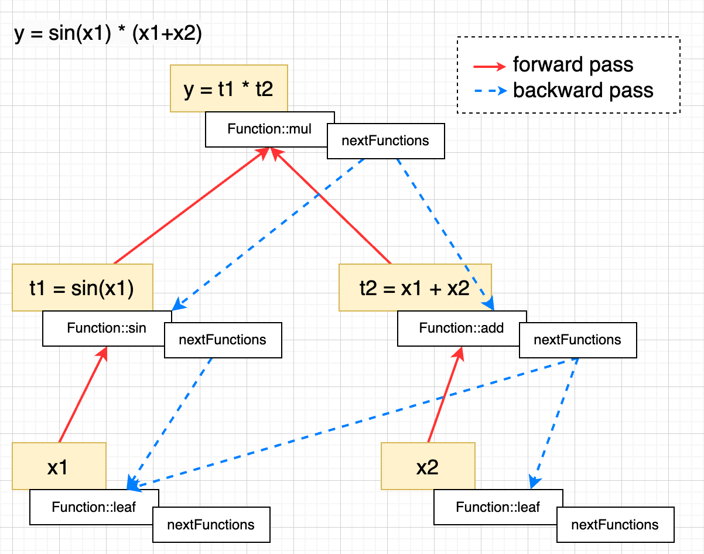

# TinyTorch

A lightweight deep learning training framework implemented from scratch in C++, featuring a PyTorch-style API.

For more details, please refer to the blog post: [Write a nn training framework from scratch](https://robot9.me/write-nn-framework-from-scratch-tinytorch/)

[](https://github.com/keith2018/TinyTorch/actions/workflows/cmake_linux.yml)
[](https://github.com/keith2018/TinyTorch/actions/workflows/cmake_macos.yml)
[](https://github.com/keith2018/TinyTorch/actions/workflows/cmake_windows.yml)

## Key Features

- **PyTorch-style API** &mdash; Familiar naming conventions (`Tensor`, `nn.Module`, `Optimizer`, `DataLoader`).
- **Pure C++ implementation** &mdash; No dependency on external deep learning libraries, C++17 only.
- **CPU & CUDA** &mdash; Runs on both CPU (with BLAS acceleration) and CUDA-enabled GPUs.
- **Mixed precision** &mdash; Supports FP16, FP32 and BF16.
- **Distributed training** &mdash; Multi-machine, multi-GPU training & inference via NCCL.
- **LLM inference** &mdash; Supports inference for LLaMA / Qwen / Mistral models: [TinyGPT](https://github.com/keith2018/TinyGPT).

## Architecture

TinyTorch implements automatic differentiation by building a dynamic computation graph. Each operation on a `Tensor` creates a `Function` node that records both the forward computation and the backward gradient rule. These nodes are linked via `nextFunctions`, forming a DAG. Calling `backward()` traverses this graph in reverse topological order, propagating gradients via the chain rule.



## Project Structure

```
TinyTorch/
├── src/            # Core library (Tensor, Function, nn.Module, Optimizer, ...)
├── examples/       # Standalone example programs
│   ├── autograd/   # Automatic differentiation basics
│   ├── module/     # Building models with nn.Module
│   ├── optimizer/  # Using built-in optimizers
│   ├── mnist/      # Full MNIST training pipeline
│   ├── nccl/       # NCCL collective communication
│   └── ddp/        # Distributed data-parallel training
├── test/           # Unit tests
└── third_party/    # Third-party dependencies
```

## Getting Started

### Prerequisites

- CMake 3.10+
- C++17 compatible compiler
- CUDA Toolkit 11.0+ *(optional, for GPU support)*
- NCCL *(optional, for distributed training)*

### Build

```bash
mkdir build
cmake -B ./build -DCMAKE_BUILD_TYPE=Release
cmake --build ./build --config Release
```

#### CMake Options

| Option | Default | Description |
|--------|---------|-------------|
| `TINYTORCH_BUILD_EXAMPLES` | `ON` | Build example programs |
| `TINYTORCH_BUILD_TEST` | `OFF` | Build unit tests |
| `TINYTORCH_USE_CUDA` | `ON` | Enable CUDA support |
| `TINYTORCH_USE_NCCL` | `ON` | Enable NCCL support |

### Run Examples

Each example is an independent executable:

```bash
# Autograd basics
cd examples/autograd/bin && ./tinytorch_example_autograd

# nn.Module usage
cd examples/module/bin && ./tinytorch_example_module

# Optimizer usage
cd examples/optimizer/bin && ./tinytorch_example_optimizer

# MNIST training
cd examples/mnist/bin && ./tinytorch_example_mnist
```

For distributed examples (requires NCCL and multiple GPUs):

```bash
# NCCL all-reduce
cd examples/nccl/bin && ./tinytorch_example_nccl <local_rank> <rank> <world_size>

# Distributed data-parallel training
cd examples/ddp/bin && ./tinytorch_example_ddp <local_rank> <rank> <world_size>
```

### Run Tests

```bash
cd build
ctest
```

## License

This code is licensed under the MIT License (see [LICENSE](LICENSE)).
